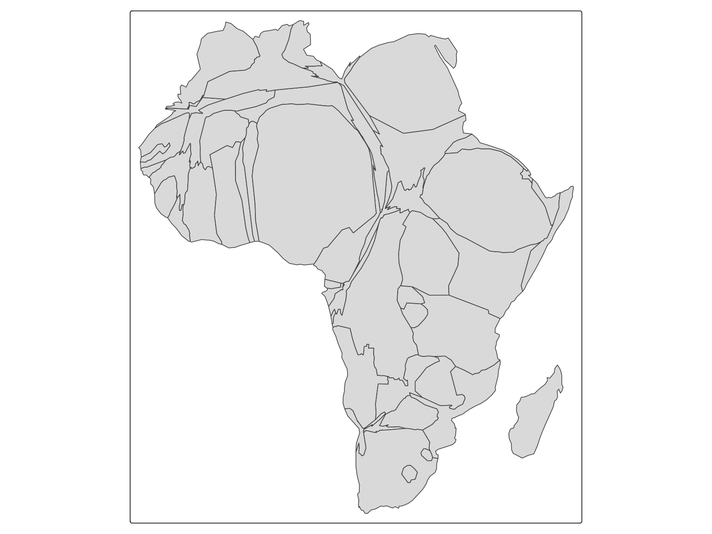
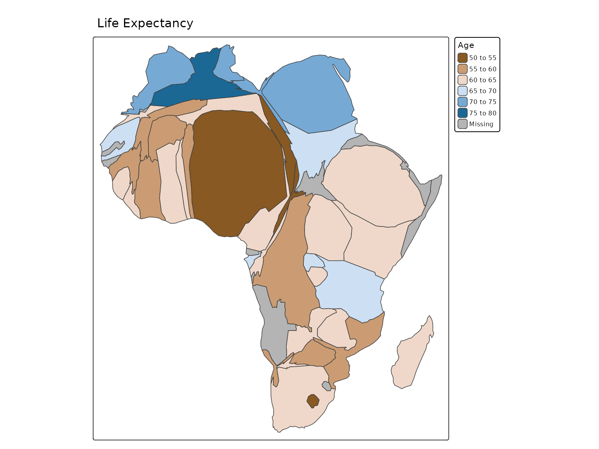

# Contiguous cartograms

## Contiguous cartograms

``` r

Africa = World[World$continent == "Africa", ]

tm_shape(Africa, crs = "+proj=robin") +
    tm_cartogram(size = "pop_est", options = opt_tm_cartogram(itermax = 15))
#> Cartogram in progress...
```



We can use polygon fill color to depict a variable, such as Happy Planet
Index:

``` r

tm_shape(Africa, crs = "+proj=robin") +
    tm_cartogram(size = "pop_est", 
                 fill = "life_exp",
                 fill.scale = tm_scale_intervals(values = "-cols4all.bu_br_div"),
                 fill.legend = tm_legend("Age"),
                 options = opt_tm_cartogram(itermax = 15)) +
tm_title("Life Expectancy")
```



We can also animate this by putting a `*` before the variable name:

``` r

tm_shape(Africa, crs = "+proj=robin") +
    tm_cartogram(size = "*pop_est", 
                 fill = "life_exp",
                 fill.scale = tm_scale_intervals(values = "-cols4all.bu_br_div"),
                 fill.legend = tm_legend("Age"),
                 options = opt_tm_cartogram(itermax = 15)) +
tm_title("Life Expectancy")
```
