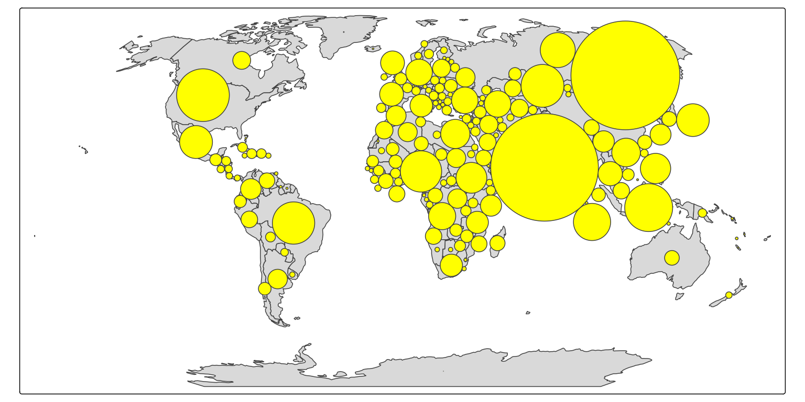
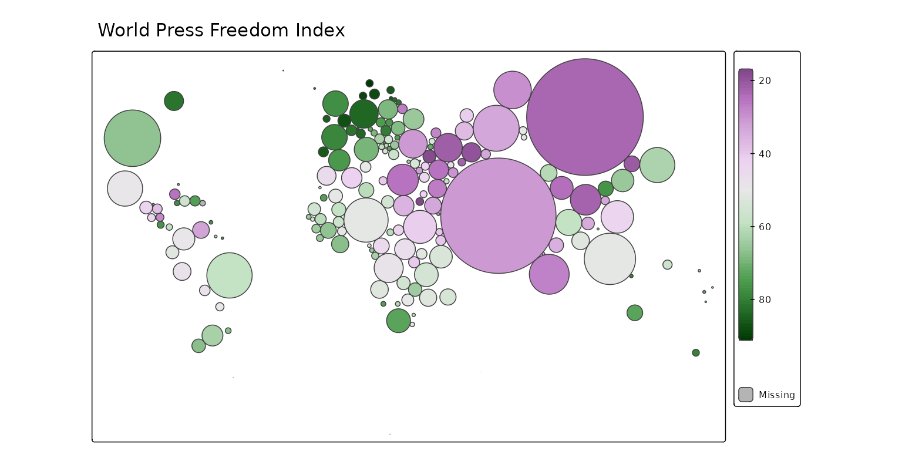

# Dorling cartograms

## Dorlin cartograms

``` r

tm_shape(World, crs = "+proj=robin") +
    tm_polygons() +
    tm_cartogram_dorling(size = "pop_est", fill = "yellow")
#> Cartogram in progress...
```



We can the bubble fill color to show some other data, such as press
freedom:

``` r

tm_shape(World, crs = "+proj=robin") +
    tm_cartogram_dorling(size = "pop_est", 
                         fill = "press",
                         fill.scale = tm_scale_continuous(values = "cols4all.pu_gn_div", midpoint = 50),
                         fill.legend = tm_legend("", height = 30)) +
tm_title("World Press Freedom Index")
```



## View mode

These maps are also available interactively. As noted above the trick in
tmap is to disable basemaps. This can be done with `tm_basemap(NULL)`:

``` r

tmap_mode("view")
#> ℹ tmap modes "plot" - "view"
#> ℹ toggle with `tmap::ttm()`
tm_shape(World, crs = "+proj=robin") +
    tm_cartogram_dorling(size = "pop_est", 
                         fill = "press",
                         fill.scale = tm_scale_continuous(values = "cols4all.pu_gn_div", midpoint = 50),
                         fill.legend = tm_legend("", height = 30)) +
tm_title("World Press Freedom Index") +
tm_basemap(NULL)
#> [view mode] WebGL does not work (yet) with projected map projections, so it has
#> been disabled.
#> This message is displayed once per session.
```
