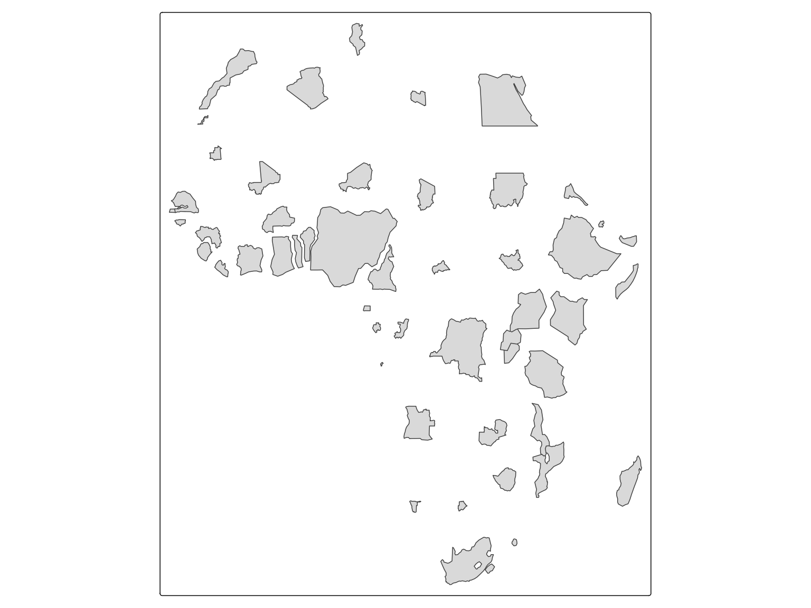
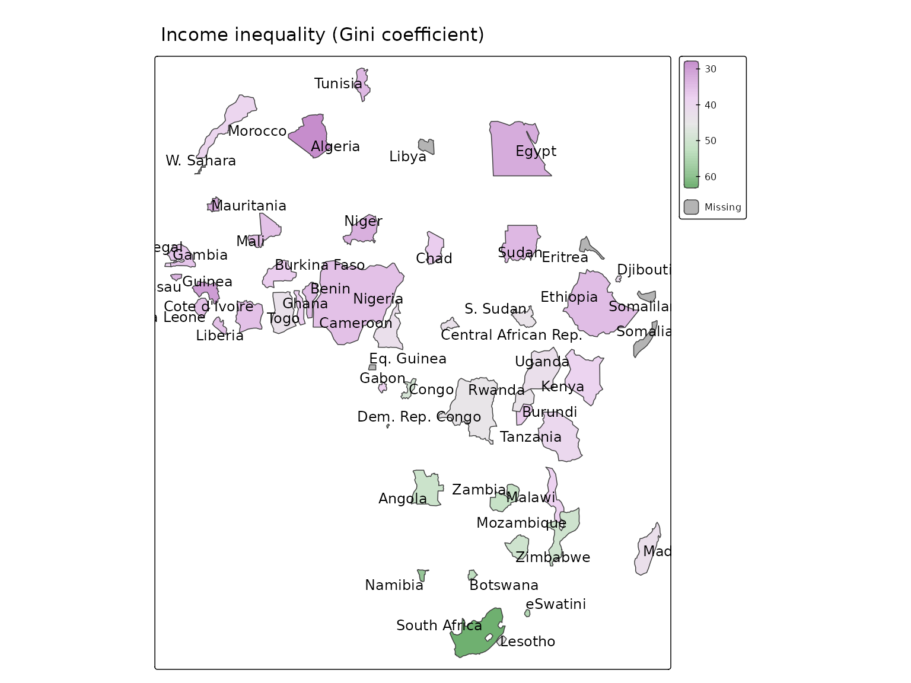
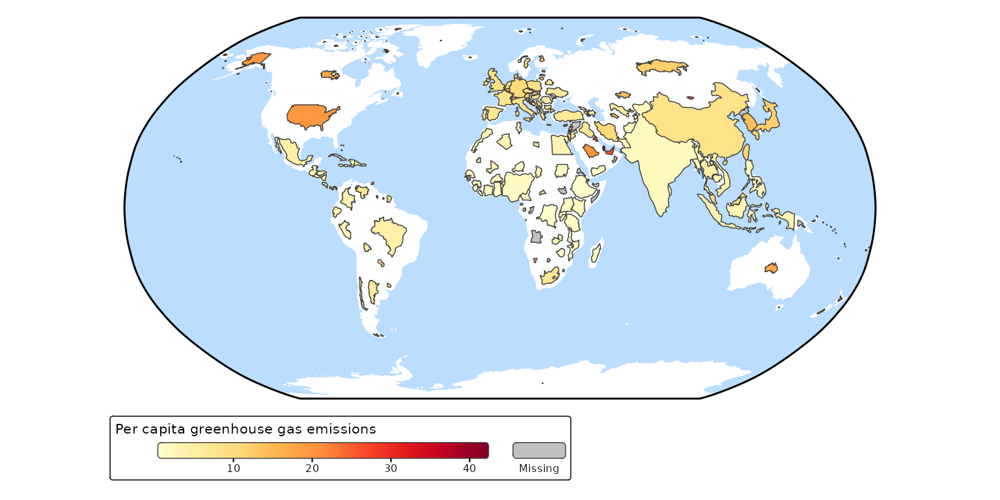

# Non-contiguous cartogram

## Non-contiguous cartograms

``` r
Africa = World[World$continent == "Africa", ]
```

``` r
tm_shape(Africa, crs = "+proj=robin") +
    tm_cartogram_ncont(size = "pop_est", options = opt_tm_cartogram_ncont())
#> Cartogram in progress...
```



``` r
tm_shape(Africa, crs = "+proj=robin") +
    tm_cartogram_ncont(size = "pop_est", 
                       fill = "inequality",
                       fill.scale = tm_scale_continuous(values = "cols4all.pu_gn_div", values.range = c(0, 0.5)),
                       fill.legend = tm_legend(""),
                       options = opt_tm_cartogram_ncont()) +
    tm_text("name", options = opt_tm_text(point.label = TRUE)) +
tm_title("Income inequality (Gini coefficient)")
```



A non-contiguous cartogram of the World. The countries are resized
relative to population. The colors indicate carbon footprint.

``` r
tm_shape(World, crs = "+proj=robin") +
  tm_polygons(fill = "white", col = NULL) +
  tm_cartogram_ncont(
    size = "pop_est", 
    fill = "footprint",
    fill.legend = tm_legend("Per capita greenhouse gas emissions", 
      orientation = "landscape", bg.color = "white"),
    fill.scale = tm_scale_continuous(values = "brewer.yl_or_rd",
      values.range = c(0, 1))) +
tm_layout(earth_boundary = TRUE,
  frame = FALSE,
  earth_boundary.lwd = 2,
  bg.color = "#bbddff",
  space.color = "white")
#> Cartogram in progress...
#> Linking to GEOS 3.12.1, GDAL 3.8.4, PROJ 9.4.0; sf_use_s2() is FALSE
```


